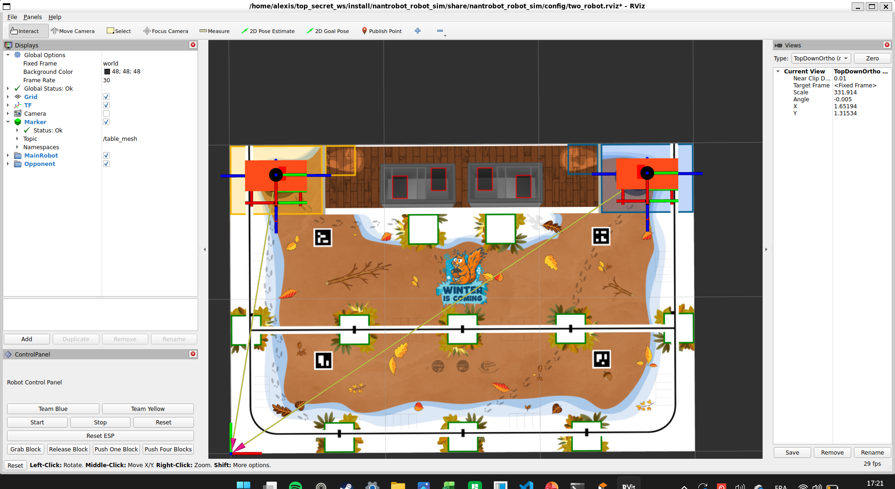

# Nantrobot Robot Simulation

A ROS2 simulation package for differential drive robots using Gazebo.

## Installation

### Prerequisites
- ROS2 jazzy (not tested on other versions, probably works on kilted and that's it)
- Gazebo

### Clone the repositories
```bash
cd ~/ros_ws/src
git clone https://github.com/ECN-Nantrobot/nantrobot_robot_sim.git
git clone https://github.com/ECN-Nantrobot/nantrobot_rviz_panel.git
```

### install dependencies
```bash
cd ~/ros_ws
rosdep install --from-paths src --ignore-src -r -y
```

### Build the workspace
```bash
cd ~/ros_ws
colcon build
```
### Quick start
To test if everything is working well

```bash
source ~/ros_ws/install/setup.bash
ros2 launch nantrobot_robot_sim two_robot_sim.launch.py
```
in another terminal
```bash
# Move the MainRobot forward
ros2 topic pub /MainRobot/cmd_vel geometry_msgs/msg/Twist '{linear: {x: 0.2, y: 0.0, z: 0.0}, angular: {x: 0.0, y: 0.0, z: 0.0}}'
```

## Launch Files

### Main Launch Files

**`two_robot_sim.launch.py`**
- Complete two-robot simulation setup with Gazebo, RViz, and all components
- The two robots are in the MainRobot and Opponent namespaces and are spawned at predefined positions
- Arguments:
  - `button_config` (optional): Path to button configuration file for RViz panels

if everything works weel it should look like this


**`start_sim.launch.py`** 
- Launches Gazebo environment with RViz visualization and table mesh
- Arguments:
  - `world` (optional): Path to custom Gazebo world file
  - `button_config` (optional): Path to button configuration file for RViz panels

**`spawn_robot.launch.py`**
- Spawns a single robot in an existing Gazebo simulation with all components
- Arguments:
  - `robot_namespace` (required): Namespace for the robot (e.g., "robot1", "robot2") 
  - `teleport_x` (optional, default: 0.3): Initial X position
  - `teleport_y` (optional, default: 1.8): Initial Y position

**`rsp.launch.py`**
- Robot State Publisher launch file for broadcasting robot state and transforms
- Arguments:
  - `use_sim_time` (optional, default: false): Use simulation time if true
  - `use_namespace` (optional, default: ''): Namespace to launch the node into

## Node Graph

## Topic Interface

This package provides a complete robot simulation with the following topic interface:

### Input Topics (Commands)
* `/{robot_namespace}/cmd_vel` (`geometry_msgs/msg/Twist`) - Direct velocity commands (highest priority in twist_mux) for something like a controller or teleoperation
* `/{robot_namespace}/cmd_vel_tracker` (`geometry_msgs/msg/Twist`) - Tracker velocity commands (medium priority)
* `/{robot_namespace}/cmd_vel_diff_count` (`geometry_msgs/msg/Twist`) - Navigation velocity commands (lowest priority) the topic that should be used by the navigation stack
* `/{robot_namespace}/set_robot_position` (`geometry_msgs/msg/PoseStamped`) - Teleport robot to specified pose for resetting or initialization

### Output Topics (Sensor Data & State)
* `/{robot_namespace}/scan` (`sensor_msgs/msg/LaserScan`) - LIDAR scan data
* `/{robot_namespace}/odom` (`nav_msgs/msg/Odometry`) - Corrected odometry data
* `/{robot_namespace}/joint_states` (`sensor_msgs/msg/JointState`) - Joint positions and velocities
* `/{robot_namespace}/robot_description` (`std_msgs/msg/String`) - Robot URDF description
* `/{robot_namespace}/camera/image_raw` (`sensor_msgs/msg/Image`) - Camera image data (not working yet)
* `/{robot_namespace}/camera/camera_info` (`sensor_msgs/msg/CameraInfo`) - Camera calibration info (not working yet)

### Visualization Topics
* `/table_mesh` (`visualization_msgs/msg/Marker`) - Table mesh to display the table in rviz

## TODO

The following features and improvements are planned for future development:

- **Physics tuning**: When stopping the robot, it continues to move a bit due to momentum, but the Gazebo controller doesn't register this movement properly
- **World file enhancement**: Add a world file with the table geometry to simulate physical walls for collision detection
- **Opponent robot behavior**: Add a small node to make the opponent robot move randomly for more realistic simulation scenarios